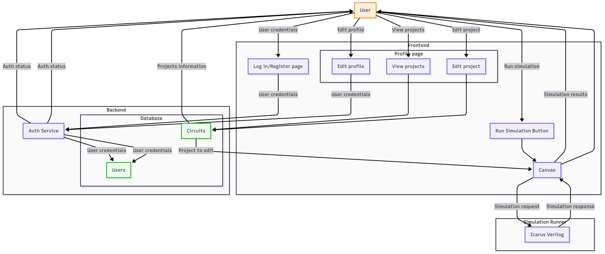

<a id="readme-top"></a>

[![Contributors][contributors-shield]][contributors-url]

### <div align="center"> 
# <div align="center">Visual-Circuit-Designer<div>
Visual-Circuit-Designer is web-based platform that could provide students and learners good experience in designing circuits similar to the Block Diagrams (like on Computer Architecture), but without the need to install Quartus Prime or huge Virtual box image. 


[Link to our product](https://www.visual-circuit-designer.ru/)

[DEMO](https://www.dropbox.com/scl/fi/mze6fzacqzvccibqd7kt5/Screen-Recording-2025-07-13-at-18.40.22.mov?rlkey=czj11gd1n8xcegfsybchm6tyn&st=1ittlg4n&dl=0)


## <div align="center">Usage</div>

### <div align="center">Project goal</div>

The goal of our project is to create web-based platform for designing, simulating, and managing digital logic circuits with an intuitive interface.

### <div align="center">Project Context Diagram</div>



#### Key Components 
1. User(student/engineers who will use out product)
2. Database(to store projects and users information)
3. Frontend(User Interface with which the user interacts)
4. Backend(this part user can not see, bur it exists)
5. Runner node(to run simulation)

### <div align="center">Feature Roadmap</div>

- [x] Add drag and drop to place circuits on grid
- [x] Add simulation with ability to change inputs in real time
- [x] Add ability to locally store projects
- [x] Add ability to upload projects from users device
- [ ] Add ability to store projects in the cloud storage
- [ ] Add ability to share projects among users community
- [x] Add multiple tabs to work on several projects at the same time
- [x] Add multiple themes of UI to make it more comfortable
- [ ] Add reusable custom blocks to simplify complex designs

### <div align="center">Usage Instructions</div>

Follow these steps to launch and explore the MVP v2:

1. **Open the Application**  
  - Navigate to [Visual Circuit Designer](https://www.visual-circuit-designer.ru)

2. **Access**  
  - The service is **completely free** and **open**.  
  - **No registration** or user account is required.

3. **Core Functionality**  
  - **Create & Edit** logical circuits using basic components.  
  - **Configure** various global settings via the **Settings** menu.

4. **Exploration & Testing**  
- Once the page loads, you’ll land directly in the workspace.  
- Use the **Menu** to drag-and-drop components onto the canvas.
- Switch between tools and pick different wire styles (bezier, step and straight) directly from the toolbar to control how connections are drawn.
- Open the **Settings** panel to fine-tune circuit and application options.

### <div align="center">Project Installation</div>

For those who want locally launch our project

1. **Clone the repository**

      In terminal run 
    ```bash
      git clone https://github.com/IUMusicalFish19/Visual-Circuit-Designer
    ```
2. **Navigate to project**

      In terminal run
    ```bash
      cd Visual-Circuit-Designer
    ```
3. **Make sure you have all needed dependencies**

      In terminal run
    ```bash
      cd UI
      npm install
    ```
4. **Make sure you have needed Runner Node requirements**
    This part depends on Operation System you have
   - For _Linux_:

    Type in terminal:
    ```bash
        sudo apt-get update
        sudo apt-get install -y iverilog
    ```
    - For _macOS_:
    
      Type in terminal
    ```bash
        sudo port install iverilog
    ```
    - For _Windows_:
    
      Install Icarus Verilog from this [site](https://bleyer.org/icarus/)
5. **Install Python dependencies**
    ```bash
        python -m pip install --upgrade pip
        pip install -r RunnerNode/requirements.txt
    ```
   
6. **Run Runner Node Server**
    ```bash
       PYTHONPATH=RunnerNode uvicorn connect:socket_app --host 0.0.0.0 --port 80 --reload
    ```
   
7. **Run Frontend Server**
    ```bash
       cd UI
       npm run dev
    ```

8. **Open Project**
    Open the link from terminal and get started!

## Documentation
- [Development](./CONTRIBUTING.md)
- [Quality characteristics and quality attribute scenarios](./docs/quality-attributes/quality-attribute-scenarios.md)
- Quality assurance:
  - [Automated tests](./docs/quality-assurance/automated-tests.md)
  - [User acceptance tests](./docs/quality-assurance/user-acceptance-tests.md)
- Build and deployment automation
  - [Continuous Integration](./docs/automation/continuous-integration.md)
  - [Continuous Deployment](./docs/automation/continuous-delivery.md)
- [Architecture](./docs/architecture/architecture.md) with Static view, Dynamic view, Deployment view and Tech Stack

## Contributors (for customer)

Top developers:

<a href="https://github.com/IUMusicalFish19/Visual-Circuit-Designer/graphs/contributors">
  
</a>

- [Konstantin Smirnov](https://github.com/kostya2505) - Frontend Developer
- [Albert Khechoyan](https://github.com/RII6) - Frontend Developer
- [Matvei Kantserov](https://github.com/Doshqq) - Backend Developer
- [Tatiana Dudnikova](https://github.com/witch2256) - Frontend Developer
- [Arseny Lashkevich](https://github.com/arsenez2006) - Backend Developer


[contributors-url]: https://github.com/IUMusicalFish19/Visual-Circuit-Designer/graphs/contributors
[contributors-shield]: https://img.shields.io/badge/Contributors-5-black
