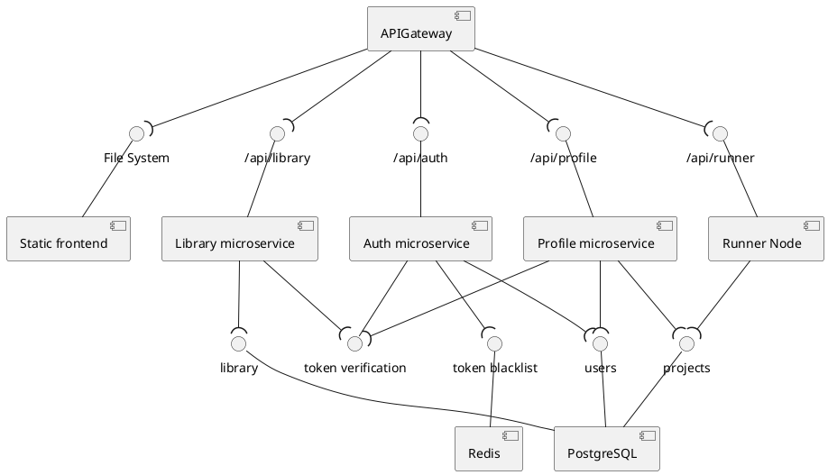
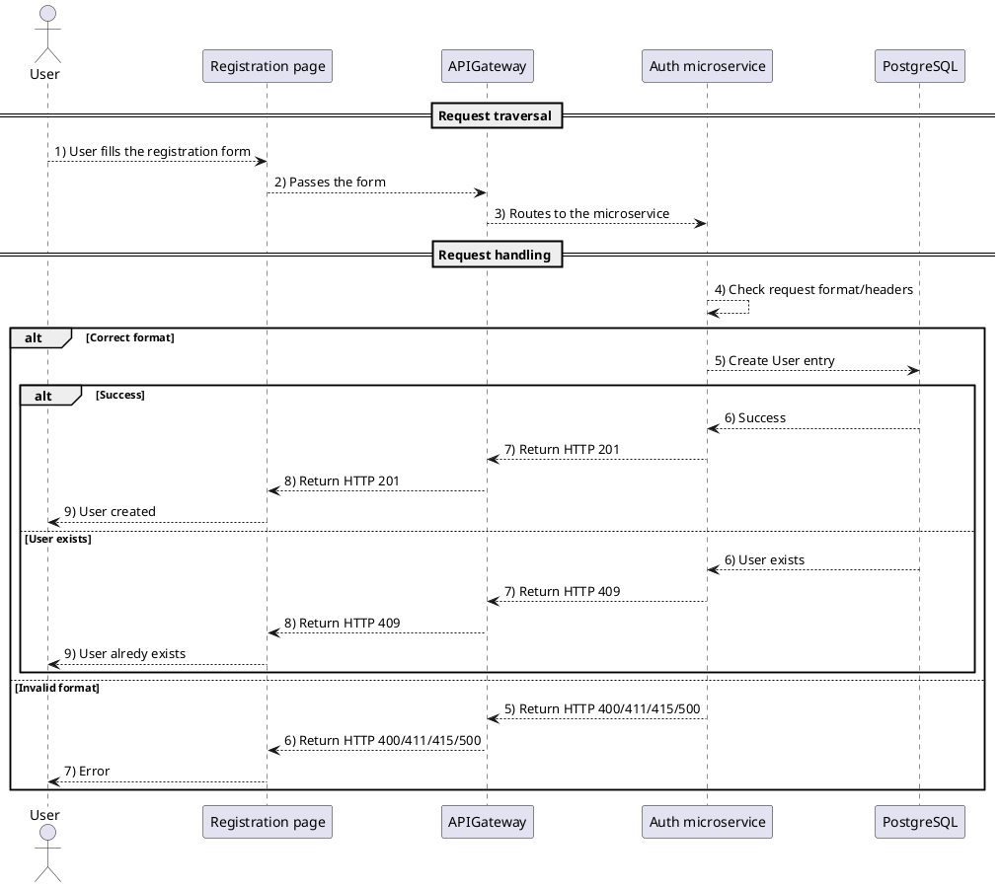
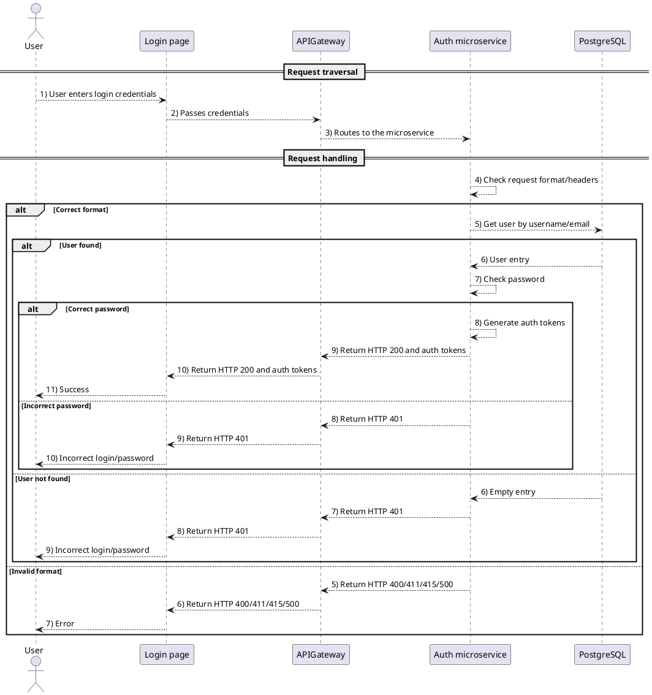
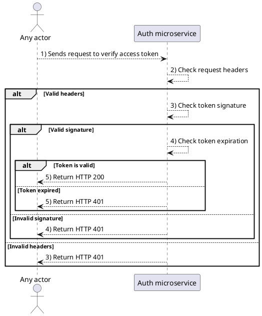
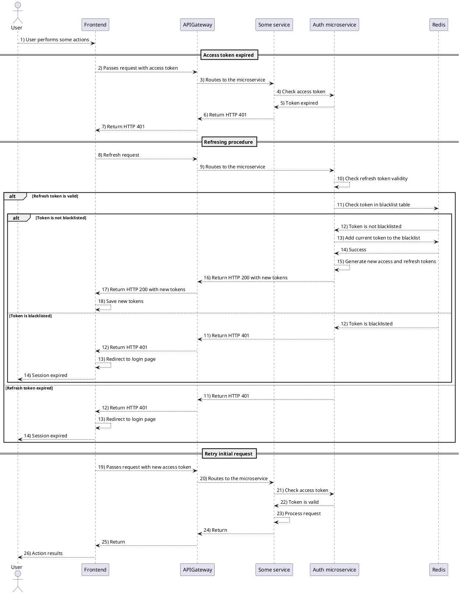

# 
Architecture Overview

The system follows a microservice architecture with an API Gateway as the central entry point, serving as a reverse proxy to route requests to appropriate backend services. The architecture includes four main microservices, a frontend component, and supporting data stores.
## 
Static view

### Key components
1) **API Gateway**
    - Acts as the single entry point for all client requests
    - Routes requests to appropriate microservices based on path:
        - `/api/runner` -> Runner Node
        - `/api/profile` -> Profile microservice
        - `/api/auth` -> Auth microservice
        - `/api/library` -> Library microservice
        - Serves static frontend files from the File System
2) **Microservices**
    - **Auth microservice**
        - Manages user authentication and authorization
        - Handles token blacklisting and verification
        - Stores user credentials and authentication data
    - **Profile microservice**
        - Manages user profiles and projects
        - May require token verification for access
    - **Library microservice**
        - Manages public library
        - May require token verification for access
    - **Runner Node**
        - Executes simulators for user projects
3) **Frontend**
    - Staticly built frontend application served directly by the API Gateway
    - Interacts with backend services through the API Gateway
4) **Data stores**
    - **PostgreSQL**:
        - Primary relation database storing:
            - User data
            - Projects data
            - Library content
    - **Redis**
        - Used by Auth service for token blacklist management
        - Provides fast access to temporary authenication data
### Communication Patterns
- All client requests first hit the API Gateway
- Microservices communicate with their dedicated database components
- Auth services provides centralized token verification used by other services
- Frontend is served as static files with API calls routed through the gateway

## 
Dynamic view

### Auth microservice
The **Auth microservice** is responsible for **authentication**, **authorization**, and **token management** in the system.
- **User Registration Flow**\
  **Endpoint:** `/api/auth/register`\
  **Purpose:** Create a new user account.

  
- **User Login Flow**\
  **Endpoint:** `/api/auth/login`\
  **Purpose:** Authenticate user and issue access & refresh tokens.

  
- **Token Verification Flow**\
  **Endpoint:** `/api/auth/verify`\
  **Purpose:** Validate and access token (used by other services).

  
- **Token Refresh Flow**\
  **Endpoint:** `/api/auth/refresh`\
  **Purpose:** Renew expired access tokens using a refresh token.

  

## 
 Deployment view 

The system is deployed using **Coolify** for container orchestration, with **Nginx** serving as the API Gateway and reverse proxy.

### Key aspects
- **Hosting**:
    - Domain: `visual-circuit-designer.ru` (HTTPS via Coolify's reverse proxy)
    - Static frontend files and `nginx.conf` are stored in **Coolify-managed storage**.
- **Microservices**
    - **Auth**, **Profile**, **Library**, and **Runner** run as **Docker containers** in an isolated network.
    - Services communicate via **internal HTTP** (routed by Nginx).
- **Data Stores**
    - **PostgreSQL** (primary database for users, projects, and library data)
    - **Redis** (used by **Auth** for token blacklisting)

This architecture ensures **secure, scalable, and maintainable** deployment with clear separation of concerns.

## 
Tech Stack

<ul>
  <li><code>Frontend</code>: React.js, JavaScript, CSS</li>
  <li><code>Backend</code>: Python, C++</li>
  <li><code>Runner node</code>: Python</li>
</ul>
